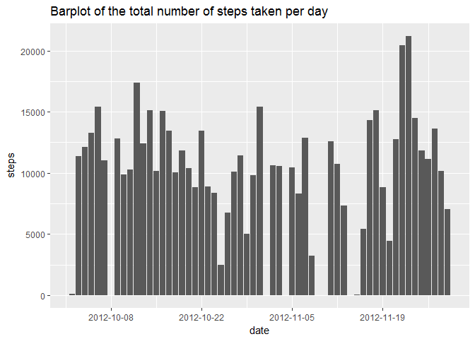
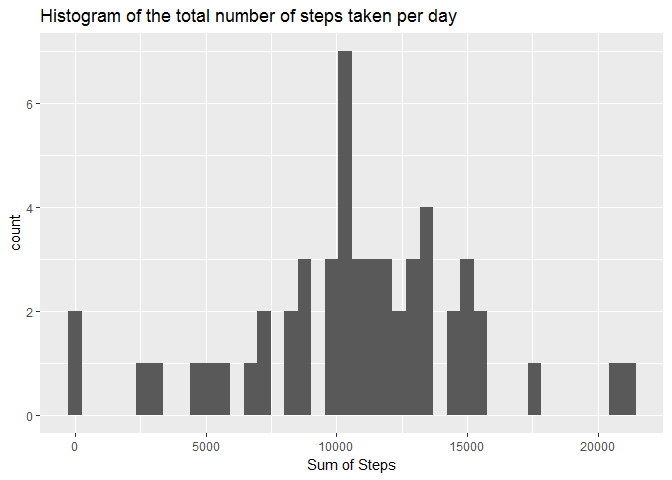
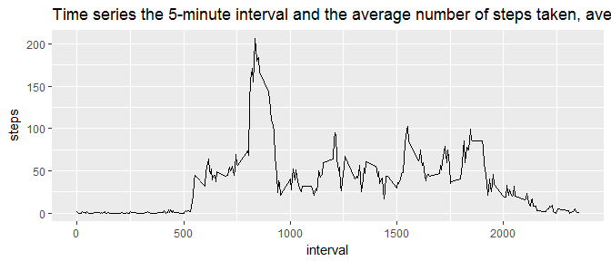
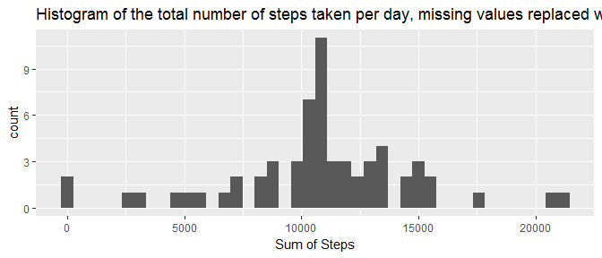
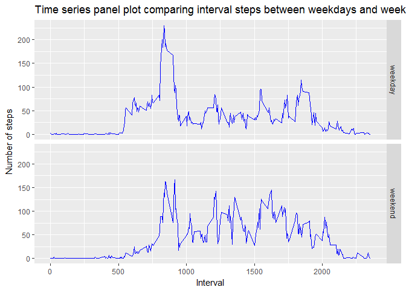

# Reproduceable Research Course Project 1
Author: kimnewzealand
Date: 12 March 2017

This report is submitted in conjunction with John Hopkins Reproduceable course as part of the Data Science Specialization.


## Loading and preprocessing the data


```r
# Load the data
setwd("C:/Users/Home/Documents/ResearchProject1")
activity <- read.csv("activity.csv")
activitysummary <- summary(activity)
# Process/transform the data. Date has loaded as a factor but converted to a date class
activity$date <- as.Date(activity$date,format ="%Y-%m-%d")
```

### Summary of processed data in activity dataset:

The R summary of the data is :


|   |    steps      |        date     |   interval    |
|:--|:--------------|:----------------|:--------------|
|   |Min.   :  0.00 |2012-10-01:  288 |Min.   :   0.0 |
|   |1st Qu.:  0.00 |2012-10-02:  288 |1st Qu.: 588.8 |
|   |Median :  0.00 |2012-10-03:  288 |Median :1177.5 |
|   |Mean   : 37.38 |2012-10-04:  288 |Mean   :1177.5 |
|   |3rd Qu.: 12.00 |2012-10-05:  288 |3rd Qu.:1766.2 |
|   |Max.   :806.00 |2012-10-06:  288 |Max.   :2355.0 |
|   |NA's   :2304   |(Other)   :15840 |NA             |


## What is mean total number of steps taken per day


```r
# Calculate the sum of steps by grouping date using dplyr, and review structure of sumSteps results 

sumsteps <- aggregate( steps~date, activity, sum , na.omit=TRUE )
stepssummary <- summary(sumsteps)
lensumsteps <- length(unique(sumsteps$date)) 

# Plot barplot with ggplot2 with function ggplot to view comparison to a histogram
ggplot(data = activity,
        aes(date,steps)) +
        stat_summary(fun.y = sum,geom = "bar")+
        scale_x_date(date_breaks = "2 week" )+
        ggtitle("Barplot of the total number of steps taken per day")
```

```
## Warning: Removed 2304 rows containing non-finite values (stat_summary).
```

<!-- -->

```r
# Plot histogram with ggplot2 function qplot, with range 41:21194 as the binwidth parameter derived from summary
qplot(steps, data = sumsteps,binwidth=21194/41,xlab="Sum of Steps",main="Histogram of the total number of steps taken per day")
```

<!-- -->

The sum has been taken of total steps each day ignoring the interval variable. 
There are 53 unique dates which matches the number of observations in the summary of the steps by date. 

The R summary of the data including mean and median of the total number of steps 


|   |     date          |    steps     |
|:--|:------------------|:-------------|
|   |Min.   :2012-10-02 |Min.   :   42 |
|   |1st Qu.:2012-10-16 |1st Qu.: 8842 |
|   |Median :2012-10-29 |Median :10766 |
|   |Mean   :2012-10-30 |Mean   :10767 |
|   |3rd Qu.:2012-11-16 |3rd Qu.:13295 |
|   |Max.   :2012-11-29 |Max.   :21195 |


## What is the average daily activity pattern?


```r
# Plot time series of the 5-minute interval (x-axis) and the average number of steps taken, averaged across all days (y-axis)
ggplot(data = activity, aes(interval,steps)) +
      stat_summary(fun.y = mean,geom = "line")+
      ggtitle("Time series the 5-minute interval and the average number of steps taken, averaged across all days")
```

```
## Warning: Removed 2304 rows containing non-finite values (stat_summary).
```

<!-- -->


```r
# Calculate the maximum 5-minute interval of the mean steps
intervalmean <- aggregate( steps~interval, activity, mean,na.omit=TRUE )
maxinterval <- arrange(intervalmean,desc(steps))
maxinterval <- maxinterval[1,1]
```
The 5-minute interval that, on average, contains the maximum number of steps is 
835

## Imputing missing values


```r
# Calculate the total number of missing values in the dataset
stepsNAs <- sum(is.na(activity$steps)) 
```

There are 2304 missing values shown as NA's.

```r
# Strategy for filling in all of the missing values in the dataset, create a find.mean function and using plyr package to apply across interval groups
activityNAs <- sum(is.na(activity$steps))
lenactivity <- length(activity)
find.mean <- function(x) {
  replace(x, is.na(x), mean(x, na.rm = TRUE))
}
# Create a new dataset activity1 that is equal to the original dataset but with the missing data filled in
activity1 <- ddply(activity, ~ interval, transform, steps = find.mean(steps))# nos. checked
activity1$date <- as.Date(activity1$date,format ="%Y-%m-%d")
activity1$steps <- as.integer(activity1$steps)
sumsteps1 <- aggregate( steps~date, activity1, sum )
stepssummary1 <- summary(sumsteps1)
qplot(steps, data = sumsteps1,binwidth=21194/41,xlab="Sum of Steps",main="Histogram of the total number of steps taken per day, missing values replaced with interval means")
```

<!-- -->
The NA values have been replaced and filled in a new dataset activity1 with the averages of the intervals.

### Do these values differ from the estimates from the first part of the assignment. 
### What is the impact of imputing missing data on the estimates of the total daily number of steps.

Comparing the summary before and after replacing the missing values, there is no change to the summary of the steps, but the date statistics are different.

## Are there differences in activity patterns between weekdays and weekends


```r
# Create a new factor variable in the dataset activity1 with two levels – “weekday” and “weekend” indicating whether a given date is a weekday or weekend day
activity1$weekday <- activity1 %>% 
      select(date) %>% 
      mutate(day=weekdays(date)) %>% 
      mutate(weekDay = ifelse(day%in% c("Saturday","Sunday"), "weekend", "weekday"))
activity1$weekday <- activity1$weekday[,3]  

# Plot time series using ggplot to calculate means of steps and plot panels 
ggplot(data = activity1, aes(interval,steps)) +
      stat_summary(fun.y = mean,geom = "line",col="blue")+
      facet_grid(weekday~.)+
      ggtitle("Time series panel plot comparing interval steps between weekdays and weekend")+
      xlab("Interval")+
      ylab("Number of steps")
```

<!-- -->

### Summary of activity patterns between weekdays and weekends
Using the dataset with the filled-in missing values,a panel plot containing a time series of steps by interval for weekday compared to weekend dates. The weekday steps peak higher and earlier in the day, but tail off more later in the day than on than the weekend.
